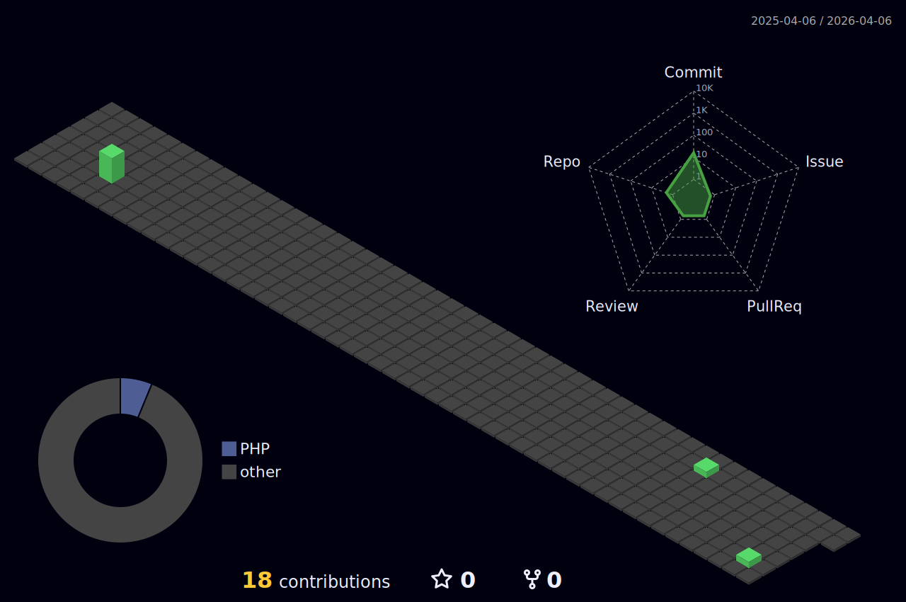

      Ola,sou o Guilherme Marques
      
            🙋‍♂️ Tenho bacharel no curso de ciencia da computação, obtido na Unifenas em Alfenas-MG, 
                  trabalho na area em torno de 1 ano e 6 meses como desenvolvedor full stack,
                  sempre busco melhorar nas tecnologias que já utilizo, como também estou sempre de olho
                  em novas tecnologias do mercado afim de estar preparado e capacitado para novas tendências.

      

      

      
      
      

